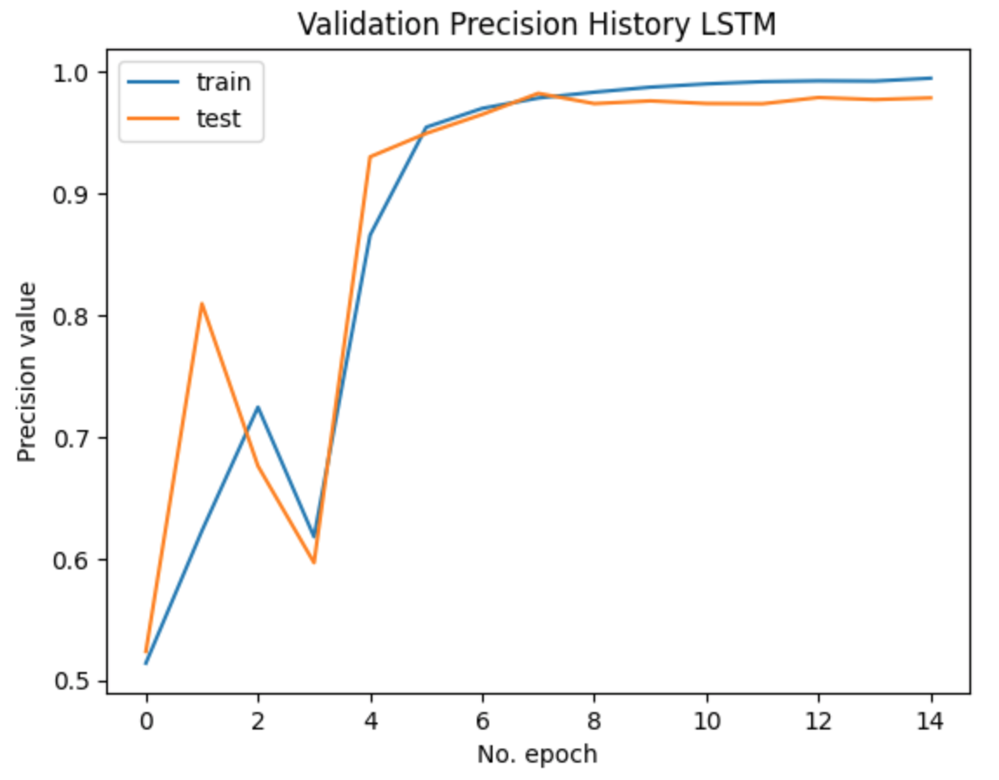
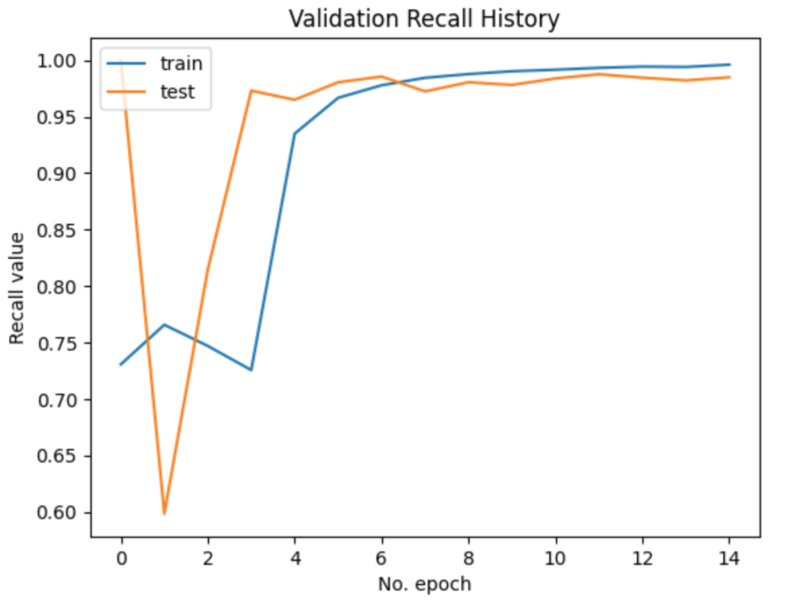

# Project Overview
The rise of social media has facilitated the widespread spread of false information, with platforms like Twitter, Facebook, and Reddit being particularly susceptible to misinformation. This has led to significant challenges for society, including the dissemination of rumors, manipulation of political outcomes, and the increase in clickbait content. Detecting fake news is essential for maintaining societal well-being, and various methods, including traditional classification and advanced neural networks, have been developed to address this issue.

The project aims to develop a natural language processing application from the ground up and then host it using Flask.

# Python Packages Used
General Purpose: os, request, re, json, time   
Data Manipulation: pandas, NumPy   
Data Cleaning: [NLTK](https://www.nltk.org/)   
Data Visualization: [Matplotlib](https://matplotlib.org/)  
Machine Learning: [Scikit-learn](https://scikit-learn.org/stable/install.html), [Tensorflow](https://www.tensorflow.org/guide/keras), [Gensim](https://pypi.org/project/gensim/), [Optuna](https://optuna.org/) 

# Dataset
[WELFake Dataset](https://www.kaggle.com/datasets/saurabhshahane/fake-news-classification)

# Results 

ML/DL Model Results

| Models   | Precision | Recall | F1-Score |
|----------|-----------|--------|----------|
| RF       |   0.94    |  0.94  |   0.94   |
| SVM      |   0.96    |  0.97  |   0.96   |
| LSTM     |   0.97    |  0.98  |    -     |

## LSTM Evaluation

   <figcaption>Fig: 16-Bit RGB Image</figcaption>
   
  

