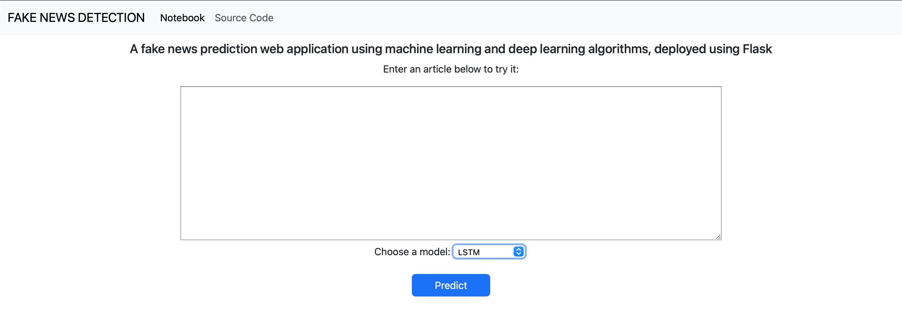

# Fake News Detection Web App Using Flask
The rise of social media has facilitated the widespread spread of false information, with platforms like Twitter, Facebook, and Reddit being particularly susceptible to misinformation. This has led to significant challenges for society, including the dissemination of rumors, manipulation of political outcomes, and the increase in clickbait content. Detecting fake news is essential for maintaining societal well-being, and various methods, including traditional classification and advanced neural networks, have been developed to address this issue.

The project aims to develop a natural language processing application from the ground up and then host it using Flask.

|<br>Homepage|
|:-:|

|<br>Prediction Page|
|:-:|

# Python Packages Used
General Purpose: os, request, re, json, pickle, time <br /> 
Data Manipulation: [pandas](https://pandas.pydata.org/), [NumPy](https://numpy.org/) <br /> 
Data Cleaning: [NLTK](https://www.nltk.org/) <br /> 
Data Visualization: [Matplotlib](https://matplotlib.org/)<br /> 
Machine Learning: [Scikit-learn](https://scikit-learn.org/stable/install.html), [Tensorflow](https://www.tensorflow.org/guide/keras), [Gensim](https://pypi.org/project/gensim/), [Optuna](https://optuna.org/) <br/>
Web Development: HTML/CSS, [Flask](https://flask.palletsprojects.com/en/3.0.x/)

# Dataset
[(WELFake)](https://www.kaggle.com/datasets/saurabhshahane/fake-news-classification) is a dataset of 72,134 news articles with 35,028 real and 37,106 fake news.
The dataset contains four columns: Serial number (starting from 0); Title (about the text news heading); Text (about the news content); and Label (0 = fake and 1 = real).

## Data Preprocessing 
Before initiating text classification, it's crucial to preprocess news articles to ensure data quality and model effectiveness. This preprocessing involves several steps:
- Cleaning: punctuation, numerical values, and extra white spaces. This step prepares the text for analysis by eliminating irrelevant elements that could confuse the model.
- Stop Word Removal: Eliminate common sets of words (stop words) that do not contribute significantly to the meaning of the text. 
- Lemmatization: Convert words to their base or dictionary form. This process reduces words to their root form, enhancing the model's ability to understand the text by reducing the complexity of the input data.

# Code Structure 
```bash
.
├── README.md
├── app.py                   # Web app implementation using Flask
├── clean_data.py            # Extract and clean the dataset
├── dl_model.py              # DL model implementation
├── figures                  # Model evaluation figures
├── ml_model.py              # ML model implementation
├── model                    # Saved model and its tokenizer
│   └── vectorizer.pickle
├── notebooks                # detailed analysis and implementation of the ML and DL model
│   ├── DL_Model.ipynb       # detailed implementation of the dl model
│   ├── EDA.ipynb            # detailed exploratory data analysis
│   └── ML_Model.ipynb       # detailed implementation of the ml model
├── requirements.txt         # list of dependencies 
├── static                   # stylesheet
│   └── styles
│       └── index.css
├── templates                # html pages 
│   ├── index.html           # homepage
│   ├── notebook.html        # notebook page
│   └── predictions.html     # prediction page
```

# Results and Evaluation

## ML/DL Model Results

| Models   | Precision | Recall | F1-Score |
|----------|-----------|--------|----------|
| RF       |   0.94    |  0.94  |   0.94   |
| SVM      |   0.96    |  0.97  |   0.96   |
| LR       |   0.94    |  0.95  |   0.95   |
| LSTM     |   0.97    |  0.98  |    -     |

## Model Evaluation
### LSTM Model 

|<br>LSTM Loss History|<br>LSTM Precision History|<br>LSTM Recall History|
|:-:|:-:|:-:|

### Random Forest and Logistic Regression ROC
|<br>RF ROC|<br>LR ROC|
|:-:|:-:|


