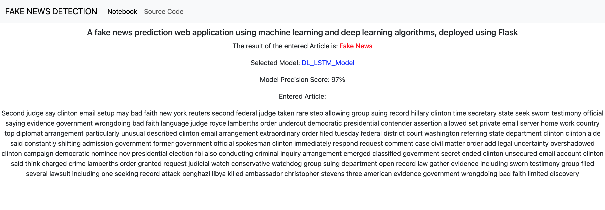
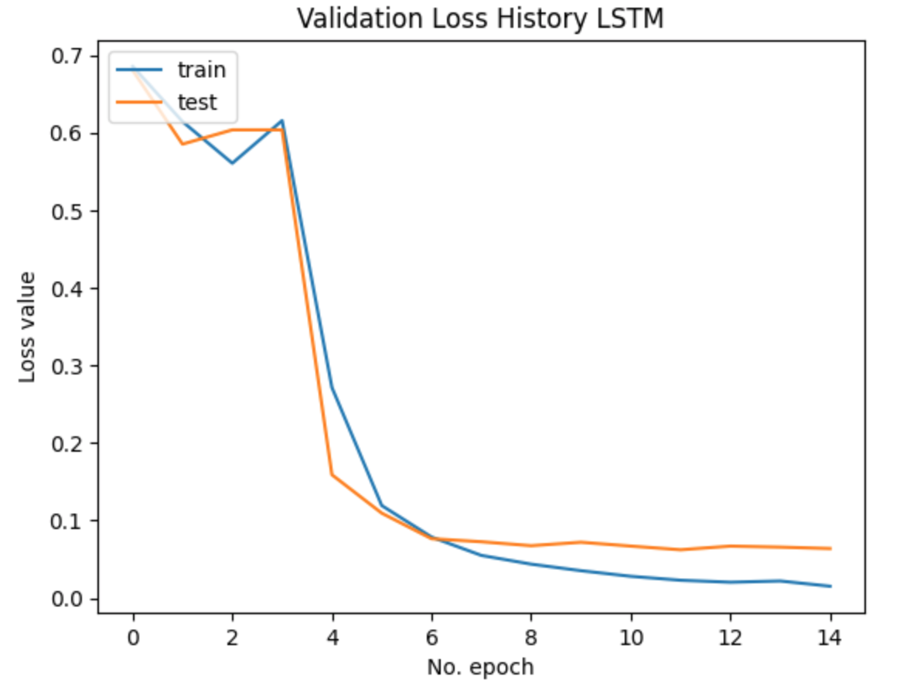

# Fake News Detection Web App Using Flask
The rise of social media has facilitated the widespread spread of false information, with platforms like Twitter, Facebook, and Reddit being particularly susceptible to misinformation. This has led to significant challenges for society, including the dissemination of rumors, manipulation of political outcomes, and the increase in clickbait content. Detecting fake news is essential for maintaining societal well-being, and various methods, including traditional classification and advanced neural networks, have been developed to address this issue.

The project aims to develop a natural language processing application from the ground up and then host it using Flask.

|<br>Homepage|<br>Prediction Page|
|:-:|:-:|


# Installation
Install projects required Python packages with pip
```bash
cd project
pip install requirements.txt
```


# Python Packages Used
General Purpose: os, request, re, json, time <br /> 
Data Manipulation: [pandas](https://pandas.pydata.org/), [NumPy](https://numpy.org/) <br /> 
Data Cleaning: [NLTK](https://www.nltk.org/) <br /> 
Data Visualization: [Matplotlib](https://matplotlib.org/)<br /> 
Machine Learning: [Scikit-learn](https://scikit-learn.org/stable/install.html), [Tensorflow](https://www.tensorflow.org/guide/keras), [Gensim](https://pypi.org/project/gensim/), [Optuna](https://optuna.org/) <br/>
Web Development: HTML/CSS, [Flask](https://flask.palletsprojects.com/en/3.0.x/)

# Dataset
[(WELFake)](https://www.kaggle.com/datasets/saurabhshahane/fake-news-classification) is a dataset of 72,134 news articles with 35,028 real and 37,106 fake news.
The dataset contains four columns: Serial number (starting from 0); Title (about the text news heading); Text (about the news content); and Label (0 = fake and 1 = real).

# Code Structure 
```bash
.
├── DL_Model.ipynb        # dl implementation notebook
├── EDA.ipynb             # explatory data analysis notebook
├── ML_Model.ipynb        # ml implementation notebook
├── README.md
├── app.py                # web app implementation using Flask
├── clean_data.py         # python script for cleaning the new articles 
├── figures               # model evaluation results 
├── ml_model.py           # ml model implementation
├── model                 # saved model and its tokenizer
│   └── vectorizer.pickle
├── requirements.txt      # list of dependencies 
├── static                # stylesheets
│   └── styles
│       └── index.css
├── templates             # html pages
│   ├── index.html
│   ├── notebook.html
│   └── predictions.html
```

# Results and Evaluation

## ML/DL Model Results

| Models   | Precision | Recall | F1-Score |
|----------|-----------|--------|----------|
| RF       |   0.94    |  0.94  |   0.94   |
| SVM      |   0.96    |  0.97  |   0.96   |
| LR       |   0.94    |  0.95  |   0.95   |
| LSTM     |   0.97    |  0.98  |    -     |

## Model Evaluation
### LSTM Model 

|<br>LSTM Loss History|<br>LSTM Precision History|<br>LSTM Recall History|
|:-:|:-:|:-:|

### Random Forest and Logistic Regression ROC
|<br>RF ROC|<br>LR ROC|
|:-:|:-:|


